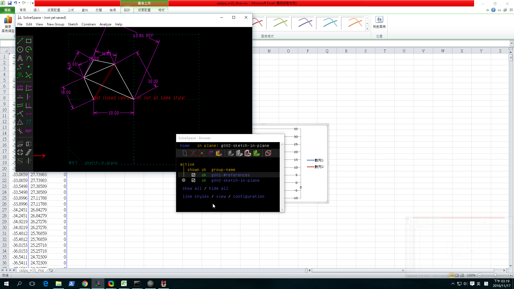
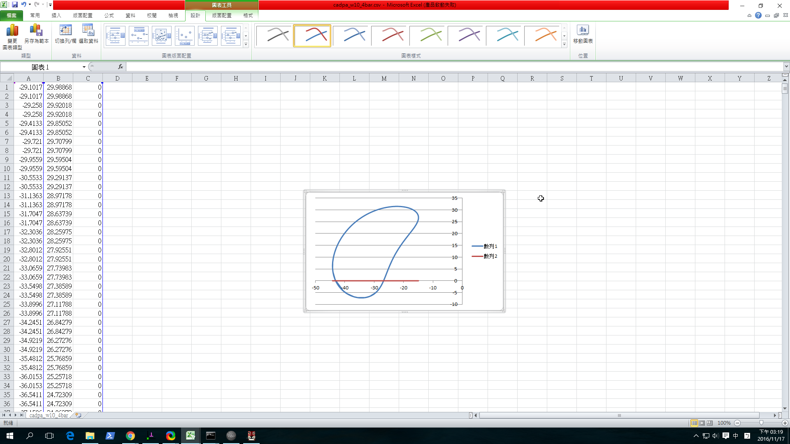

Title:電腦輔助設計實習程總結
Date: 2017-01-12 12:00
Category: Misc
Tags: 使用導引, 創造力, 表達能力, 協同設計
Author: 40423152

期末總結

<!-- PELICAN_END_SUMMARY -->

Solvespace 小畫家
<iframe src="https://player.vimeo.com/video/185643448" width="640" height="360" frameborder="0" webkitallowfullscreen mozallowfullscreen allowfullscreen></iframe>

<a href="https://vimeo.com/185643448">製圖作業_1</a> from <a href="https://vimeo.com/user46451216">Willy Lai</a> on <a href="https://vimeo.com">Vimeo</a>
## Onshape

## Solvespace 平面四連桿機構模擬

Solvespace四連桿圖檔~~~:
<a href="./../data/cadpa_w10_4bar.csv">用滑鼠戳戳看啊</a>

brython小畫家
<!-- 導入 Brython 標準程式庫 -->

<!-- 啟動 Brython -->

<!-- 以下實際利用  Brython 畫兩條直線 -->

<canvas id="fourbar" width="600" height="200"></canvas>

直接利用 Solvespace Analyze-Trace Point-Stop Trace 得到下列繞行路徑:

將所得到的點座標 .csv 以 Excel 畫圖, 得到:

#### Export Triangle Mesh

STL 格式

three.js

<iframe src="./../data/threejs/rotate.html" width="800" height="600"></iframe>

<iframe src="https://player.vimeo.com/video/199840819" width="640" height="360" frameborder="0" webkitallowfullscreen mozallowfullscreen allowfullscreen></iframe>

<a href="https://vimeo.com/199840819">2017 01 17 23 23 43 414</a> from <a href="https://vimeo.com/user46451216">Willy Lai</a> on <a href="https://vimeo.com">Vimeo</a>.

### 2. Assembly (零件組立)
<a href="http://solvespace.com/box.pl">http://solvespace.com/box.pl</a>

### 3. Linkages (fourbar & multilink) (四連桿與多連桿運動模擬)

### 4. Compiled & API (編譯與延伸應用)
<iframe src="./../data/BBB.png" width="800" height="600"></iframe>

###  Assembly (零件組立)
桿子

<iframe src="./../data/barbar~.html" width="400" height="300"></iframe>

方塊

<iframe src="./../data/blockkkk~.html" width="400" height="300"></iframe>

組立之美國配色

<iframe src="./../data/xmas~.html" width="400" height="300"></iframe>

影片如下:

<iframe src="https://player.vimeo.com/video/199840852" width="640" height="480" frameborder="0" webkitallowfullscreen mozallowfullscreen allowfullscreen></iframe> 
<a href="https://vimeo.com/199840852">2017 01 17 23 36 52 999</a> from <a href="https://vimeo.com/user46451216">Willy Lai</a> on <a href="https://vimeo.com">Vimeo</a>.

3D印表機
<iframe src="./../data/GG.html" width="400" height="300"></iframe>
<iframe src="https://player.vimeo.com/video/196696473" width="640" height="645" frameborder="0" webkitallowfullscreen mozallowfullscreen allowfullscreen></iframe>

<a href="https://vimeo.com/196696473">2016-12-22 16-32-55</a> from <a href="https://vimeo.com/user46451216">Willy Lai</a> on <a href="https://vimeo.com">Vimeo</a>.

敲核桃的機器....中文是啥啊? 胡桃鉗?

